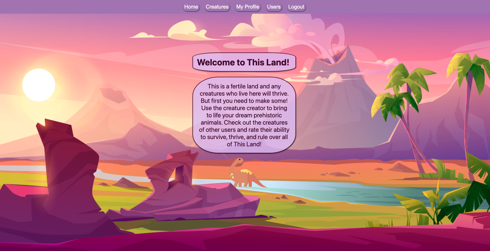
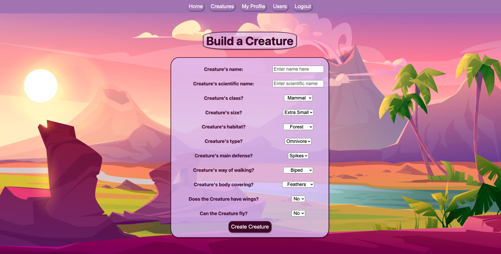
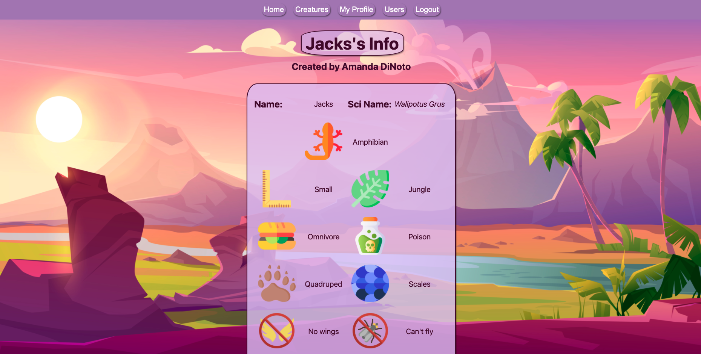

<h1>This Land</h1>
As a kid, I loved dinosaurs. I came into class on career day when I was seven dressed as an archeologist. As I've grown older, this love has not faded. I also really enjoy games where you can customize characters. I thought I would incorporate both of these interests in a application where you can build your own prehistoric creatures. Welcome to This Land! Create your own creatures, check out creatures made by other users, and rate them and their ability to survive and evolve!

<h2>To Play</h2>
The game is deployed <a href="https://this-land.fly.dev/">here</a>.

Just log in with a google account to get started. Then click on the 'Creatures' tab to views creatures other users have made. Click on 'Create a Creature' to make some of your own. When viewing other creatures, leave reviews to let others know what you think of their creations! Bonus: see if you can find the dragon egg!

Click <a href="https://trello.com/b/5WI2orWT/this-land">here</a> to view my ERD and wireframe.

<h2>Screenshots</h2>

<h2>Technologies</h2>
<ul>
  <li>Node</li>
  <li>Express</li>
  <li>MongoDB</li>
  <li>Mongoose</li>
  <li>JavaScript</li>
  <li>EJS</li>
  <li>CSS</li>
</ul>

<h2>Future Improvements</h2>
<ul>
  <li>Add mobile compatibility.</li>
  <li>Add more creature customization and more interactions between users and creatures.</li>
  <li>Add a search function for users and creatures.</li>
  <li>Give the user a prompt before a creature is deleted.</li>
</ul>

<h2>Built With</h2>
<ul>
  <li><b>Font:</b> Google Fonts https://fonts.google.com/</li>  
  <li><b>Cards:</b> Bootstrap https://getbootstrap.com/docs/4.0/components/card/</li>
  <li><b>Background Image:</b>Background vector created by upklyak https://www.freepik.com/vectors/background</li>
  <li><b>Icons and Favicon:</b> Flaticon by users Smashicons, Icongeek26, Surang, and Freepik https://www.flaticon.com/</li>
</ul>